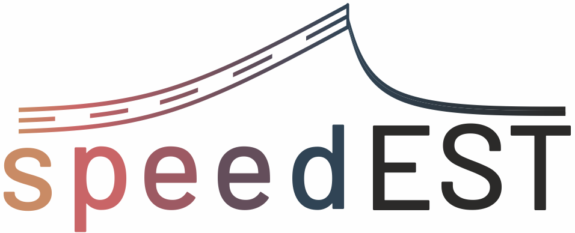

 

# Vehicle impact speed estimation using machine learning

This tool can be used to estimate the speed of the vehicle at impact with a steel road safety barrier.
The estimation is made by a few different machine learning model, which were trained on both full-scale crash tests 
and numerical simulations. The app consists of the following pages:

* __Home__ - main page with prediction of the impact speed for a given set of input features
* __Data__ - description of the input features and the datasets used in development of machine learning models
* __Models__ - presentation of the developed machine learning models
  * __Tree Ensemble__ - model based on regression trees
  * __Multilayer Perceptron__ - model based on a neural network
  * __Regularized Linear Ensemble__ - model based on linear regressors
  * __Support Vector Ensemble__ - model based on support vector machines
  * __Final Voting Ensemble__ - ensemble of machine learning models
* __About the project__ - summary of the research project

# Usage

## Online
The latest version app can is deployed [here](http://speedest.pl).

## Local
For local use, production-ready docker images are available
in the [DockerHub repository](https://hub.docker.com/r/adsci/speedest).
To run it, first make sure that Docker is installed on your system. 
Then, pull the Docker image :

```bash
docker pull adsci/speedest:latest
```

and run the container, with the necessary port mapping

```bash
docker run -p 80:8501 adsci/speedest:latest
```

After the container has started, the app can then be accessed at
[localhost](http://localhost).


# Development

## Building the Docker image

Docker images present in the [DockerHub repository](https://hub.docker.com/r/adsci/speedest)
support only the (`linux/amd64`) architecture, i.e., 
most Linux and Windows machines. 
For other architectures, such as ARM (e.g., newer Apple machines), 
it may be necessary to build and run the image locally

```bash
docker build -t speedest:latest -f Dockerfile .
docker run -p 80:8501 speedest:latest
```

## How to prepare local environment?

It is recommended to prepare a virtual environment for the project, 
making sure that Python version in the base environment is the same 
as the one specified in the Dockerfile (`3.11` at the moment)

```bash
python -m venv .venv
```

After you're done run the following command:
```
make install-requirements-dev
```
to install the dependencies.

#### NOTE
On some platforms (e.g., macOS), installation of the dependencies fails as 
no matching distribution may be found for the 
`torch` library (due to the lack of `+cpu` in library name on that platform), e.g,
```
ERROR: No matching distribution found for torch==2.3.0+cpu
```
If that's the case, recompile the requirements and install the dependencies once again:
```bash
make requirements
make install-requirements-dev
```

## How to add requirements?
If some package should be added as a requirement to this project, add it to the
`requirements/base.in` (or `requirements/dev.in` if the package is needed only for development, not in production).
For test-specific packages (e.g., `pytest`) use `requirements/test.in`.
This way, the packages are only installed in the testing environment used by `tox`.
After that, compile the requirements with:

```bash
make requirements
```
Do not forget to commit the new `.txt` files.

## How to clean local environment?

`clean` will remove all files and directories created by the above commands.

```bash
make clean
```

## Continuous Integration
Virtual environment has to be activated and all requirements should be installed.

### Linter

For this project, GitHub's CI pipline uses pre-commit hooks together with other checks 
(`pyupgrade`, `flake8`, `isort`, and `black`) to ensure good formatting of files. 
Before committing, make sure all checks pass by running
```bash
make lint
```

## Tester

For this project, GitHub's CI pipline uses `tox`, which allows for running
simultaneous tests on multiple environments. Locally, it's possible to run the
tests in a simple way by using only `tox` (like in the CI pipeline)
```bash
make test
```