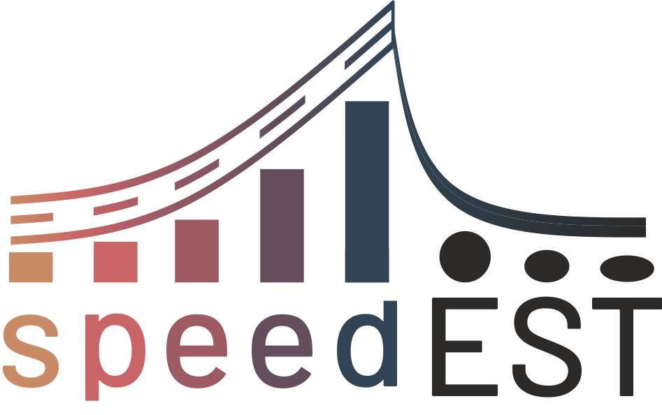

# Methods for speed estimation of a vehicle at impact with a road safety barrier

The project aims at development of mathematical models for estimation of the speed of a vehicle
at impact with a road safety barrier, based on the extent of damage done to the vehicle and the
barrier.
Proposed research tasks include preliminary studies on current techniques for estimation of the
vehicle speed at impact with a road barrier, as well as an analysis of existing databases from
both full-scale crash tests and barrier-related road accidents; conducting experimental crash
tests; carrying out advanced numerical crash simulations with various initial impact conditions;
development of mathematical models for estimation of the impact speed, including those based
on probabilistic methods as well as on artificial intelligence (AI) algorithms; development of tools
for impact speed estimation.

The main result of the project will be the extension of current databases with the results from
the crash tests and numerical simulations conducted within this project, and also the
development of the methods for speed estimation of the vehicle at impact with a barrier. The
main practical result will be the development of online tools for the assessment of the impact
speed.
The acquired knowledge and the built models will contribute to the development of the design,
management, and maintenance processes of road safety barriers as well as to the improvement
of diagnostic tools for the prediction of passenger injuries caused by road accidents involving
safety barriers. The project has substantial potential for practical application and stands out due
to the use and further improvement of advanced numerical crash test simulation and AI
algorithms.