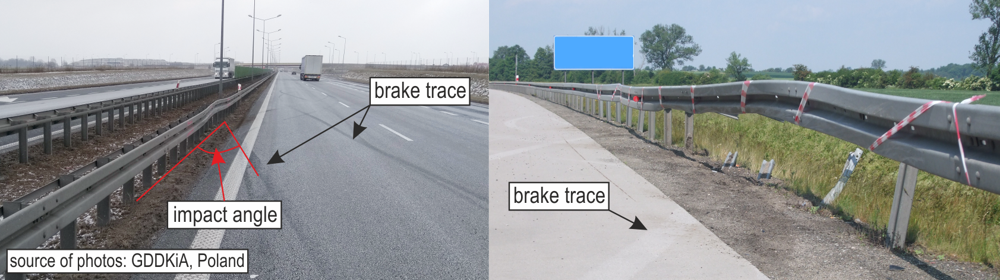
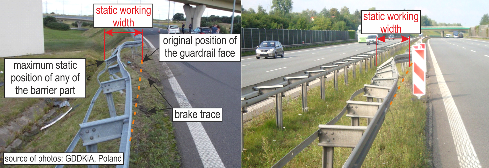
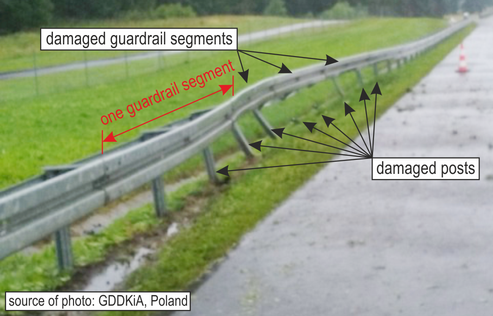
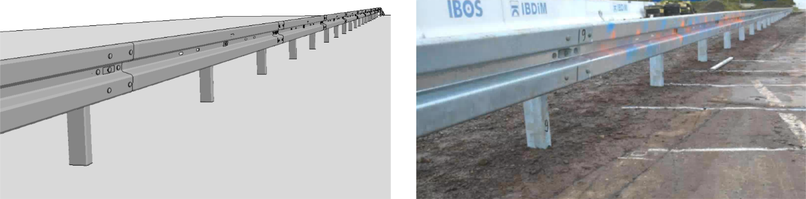
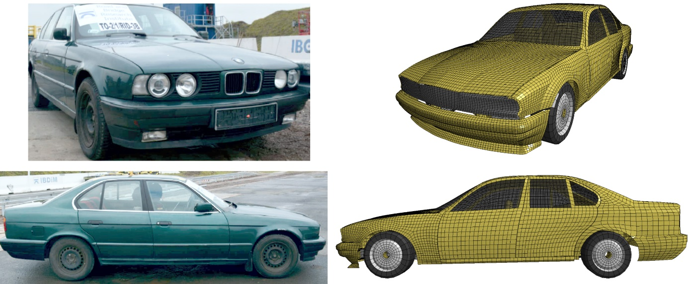

# About the data

The aim of this research was to develop tools which can be used to estimate the speed of the vehicle at impact with a road safety barrier. 
Ideally, this should be possible with a few easy to measure or estimate features available at impact site. 
Measurement/estimation of such features should not require expertise and could in principle be carried out by anyone. 
Furthermore, the chosen features should also be possible to efficiently estimated by automated computer vision systems or manually from photographs of the impact site taken by the authorities.
Having this in mind, a set of 5 input features was chosen for the problem.

## Mass of the vehicle

The first input feature is the total mass of the vehicle (in kg). The mass is easy to estimate once the model of the car is known, as this information is usually readily available. 
The mass of the occupants should be added to the mass of the vehicle. 
This could be estimated knowing the number, age and gender of the occupants.
## Impact angle

The second input feature is the impact angle (in degrees). This is the angle at which the vehicle hit the safety barrier system, relative to the road axis. 
The angle can usually be determined if there is a clear brake trace on the road or in the ground by the barrier. An example picture from which the impact angle could be estimated is shown below.

## Final displacement of the W-beam guardrail (static working width)

The third input feature is the maximum lateral deformation of the W-beam guardrail (in mm). This parameters is also called the static working width. The static working width is defined as the maximum lateral
distance between any part of the barrier on the undeformed traffic side
and the maximum position of any part of the barrier after the impact. This feature usually needs to be measured on-site or estimated from the available photographs.
An example picture with the lateral displacement marked is shown below.

## Number of damaged posts and segments

The last two input features are the numbers of damaged posts and segments of the guardrail. These can easily be counted, and the convention is to use a greedy approach, i.e., if only part of a segment is damaged, the segment is counted as damaged. An example picture is shown below. In this specific accident, 3 segments of the guardrail and 8 posts were damaged. 

Note that the post does not need to be ripped off the ground to be counted as damaged, it is enough that an excessive deformation or torsion is observed.

# Gathered data

To start with, a safety barrier system of the class N2/W4/A was chosen as the object of the study. The main components of this safety system comprise the W-beam guardrail, posts and the spacers. Each segment of the barrier is 4 m long, and the spacing between the posts is 2 m. The safety barrier system (and its numerical model) is presented below.

The data was acquired in two ways: using finite element simulations as well as full-scale crash tests [1]. In numerical simulation, a wide range of mass, impact angles, and impact speeds have been used to measure the remaining parameters. The vehicle (and its numerical model) used in the tests is shown below.

All in total, data from 253 crash tests (including real and numerical ones) was collected, the input features were extracted and the target speed values were recorded. The dataset was split into training and tests set, such that 177 examples were placed in the training set and the remaining 76 examples were used in test set. 
For model training, an additional validation set of 32 examples was sampled from the training set (leaving 145 examples for model training).

## References 

1. Wilde, K. et al. (2021). On analysis of double-impact test of 1500-kg vehicle into w-beam guardrail system, *Archives of Civil Engineering* 67(2), pp. 101-115