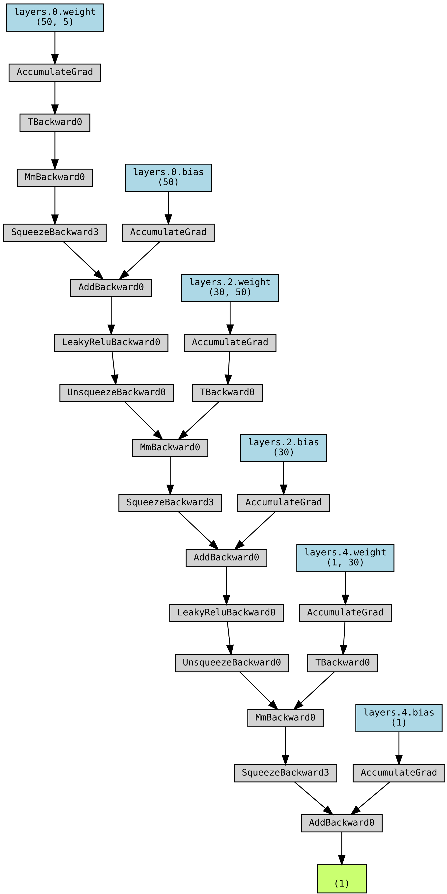

# Multilayer Perceptron model

Multilayer Perceptron is a simple feed-forward artificial neural network, in which all layers are fully-connected.
The network is build of neurons rather than perceptron (which have threshold activation) and consists of the input layer, two hidden layers and the output layer. The first and the second hidden layers contain 50 and 30 neurons, respectively.

As the number of input features is 5, there are 50 $\times$ 5 weights (and 50 biases) between the input and first hidden layer. For each neuron in the hidden layer, a weighted sum of the weights and input features is computed, and a non-linear activation function is used. In this model, the `LeakyReLU` function is considered for all hidden layers. In contrast to the classical `ReLU` activation function, the `LeakyReLU` functions allows for a small positive gradient also when the neuron is not active.

The neurons in the hidden layers are fully-connected, which results in 50 $\times$ 30 weights (and 30 biases) needed for computing the outputs of the second hidden layer (in which the same activation function is used). In the end, 30 weights (and 1 bias) are needed to compute the final output, which is the impact speed.

Network architecture is schematically depicted below, using the Netron tool [1].

The above figure shows the forward pass of the network (given inputs, the output value is computed). In order to train the network, a suitable loss function must be defined. In this case, the *mean squared error* (MSE) loss function was utilised. The loss on a given training set with $n$ examples can be computed as

$\textrm{MSE} = \dfrac{1}{n} \overset{n}{\underset{i=1}{\sum}} (y_i - \hat{y}_i)^2$,

where $y_i$, and $\hat{y}_i$ are the target and predicted values, respectively.

In each training epoch (after the whole training set is iterated over to compute the loss), stochastic gradient descent uses gradients of the loss with respect to the weights (and biases) to update the values of the weights and biases. This backward pass (backpropagation) on the network is easily taken care of by the PyTorch framework [2], thanks to its automatic differentiation engine. A more detailed layout of the neural network was created with the PyTorchViz [3] library and is shown below.

## Feature normalisation

An important aspect of training neural networks is the feature normalisation. In contrast to models based on decision tree regressors, the input features (as well as the outputs) must be normalised.
Normalisation ensures that features which originally have different scales, are of comparable values. This, in turn, speeds up the training and reduces the chanced to end up in a local minimum while minimising the loss function.
Because of this, the training and validation datasets are standardised such that each feature has a 0 mean and a standard deviation of 1, i.e., the standardised value (z-score) for feature $i$ is calculated as

$x'_i = \dfrac{x_{i} - \mu}{\sqrt{\sigma^2}}$,

where $x_i$ is the raw value of the feature $i$, $\mu$ is the mean of the population, and $\sigma^2$ is the variance of the population.
As the mean and variance of the whole population are not known, we use the unbiased estimators on the training set. Assuming that the size of the training set is $n$, we have

$\hat{\mu} = \dfrac{1}{n} \overset{n}{\underset{i=1}{\sum}} x_i$

$\hat{\sigma}^2 = \dfrac{1}{n-1} \overset{n}{\underset{i=1}{\sum}} (x_i - \hat{\mu})^2$

The target values are standardised in an analogous way.
As a result, the actual value of the loss function is computed between the standardised values

$\textrm{MSE} = \dfrac{1}{n} \overset{n}{\underset{i=1}{\sum}} (y'_i - \hat{y}'_i)^2$

It is noteworthy that during inference, the validation and test sets are standardised with respect to the means and standard deviations of the *training* set.
## Training and performance metrics
Training of the network continues for a predefined number of epochs, in this case the number of training epochs was set to 1000.
After each epoch, the value of the loss function (MSE, standardised) was computed on both the training as well as on the validation set.
Furthermore, the mean absolute error (MAE) between the target and predicted value was computed after each training epoch for the aforementioned datasets.
The MAE can gives rough estimate of the mean error on the predicted value given by the model.
The MAE is computed as

$\textrm{MAE} = \dfrac{\overset{n}{\underset{i=1}{\sum}} | y_i - \hat{y}_i |}{n}$,

where $y_i$ denotes the target value, and $\hat{y}_i$ is the value predicted by the model. It is noteworthy that before computing the MAE the standardisation is reversed, i.e., the actual predicted values are computed from the predicted z-scores.

Another useful model performance metric is the coefficient of determination, called $R^2$, which can be computed as

$R^2 = 1 - \dfrac{\overset{n}{\underset{i=1}{\sum}} ( y_i - \hat{y}_i)^2}{\overset{n}{\underset{i=1}{\sum}} ( y_i - \bar{y})^2}$,

where $\bar{y} = \dfrac{1}{n} \overset{n}{\underset{i=1}{\sum}} y_i$ is the average target value.

This score provides a measure of how well observed outcomes are replicated by the model, based on the proportion of total variation of outcomes explained by the model.
The best possible $R^2$ score is $1.0$.
Similar to the MAE, the *actual* predicted values are recalculated from the z-scores before computation of the $R^2$ score.

To evaluate model performance, the original training set (189 training examples), was repeatedly split into training and validation sets (157 and 32 examples, respectively). For each random split, the neural network was trained on the smaller training set. After training, the network made its predictions on the validation, and suitable metrics are computed. This process was repeated for 50 random splits of the full training set. 
This way, by taking the mean and standard deviation of the MAE computed on the validation sets, an estimate of model performance on unseed data is obtained.

Loss function value and the MAE for training and validations sets are plotted below. 
Note that these are the mean values over all validation and training sets.

As seen in the graph, the loss on both the training and validation set is quickly decreasing. This suggests that a minimum of the loss function has been found. Furthermore, the loss on the validation set follows the same trend and there is not much difference in model performance between these two sets, which signifies that the model is performing well. 
Having obtained the metric estimated from cross-validation, the network is subsequently retrained on the full training set.

In the following table, the final values of the MAE (in km/h) for the training, validation and test sets are summarised. The $R^2$ score on the test set is given as well. Note that the values for the validation set are in fact averaged over all validation sets.

It is noteworthy that the error on the test and validation sets are quite close to each other, which mean that the model should perform well on unseen data. 

The histogram and probability density distribution of the residuals (differences between the true and predicted values) in the validation set are presented below. Note that these are all residuals recorded in the course of cross-validation using 50 different random splits of the full training sets (a total of 1600 predictions). It can be seen that the speed residual has an approximately Gaussian distribution.

## References

1. Netron. https://github.com/lutzroeder/netron

2. PyTorch framework. https://pytorch.org/

3. PyTorchViz. https://github.com/szagoruyko/pytorchviz