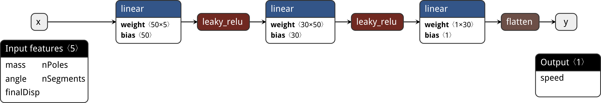

# Multilayer Perceptron model

Multilayer Perceptron is a simple fully connected feedforward artificial neural network.

## References

1. PyTorch framework. https://pytorch.org/

2. Netron. https://github.com/lutzroeder/netron

3. PyTorchViz. https://github.com/szagoruyko/pytorchviz