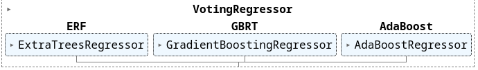

# Voting Regressor model

The Voting Regressor model [1] is an ensemble estimator that uses several base regressors and averages their prediction to form a final prediction. 
This particular model includes an extremely randomised forest [2,3], gradient boosted regression trees [4,5], and an AdaBoost regressor [6,7,8]. 
In the following, the base estimators are briefly introduced.

As all voters are based on regression trees, it is noteworthy that the input data does not need to be normalised in order to successfully train this model.

## Extremely randomised forest (`ExtraTreesRegressor`)

The extremely randomised forest model is based on the classic random forest reggression model. In random forest, an enseble of regression trees is trained with bootstrap aggregating, i.e., every predictor is trained on a random subset of the training set, sampled with replacement. Each regression tree is then grown and the training set is split into regions, so that the mean squared error between the average and the targets within the region is minimised. When splitting a node during growth of the trees, classic random forest searches for the best feature among a random subset of features. After all trees have been trained, the forest can make predictions by averaging the predictions from all trees.

Extremely randomised forest takes this one step further. Unlike regular decision trees, which search for the best possible threshold for each feature while splitting the node, a random threshold for each feature is considered. This, along with using a random subset of features at node splitting results in even greater regressor diversity, trading higher bias for a lower variance. Furthermore, random thresholds also provide a speedup in training.

To build the model, the `ExtraTreesRegressor` class in `scikit-learn` was used. An optimal set of model hyperparameters was found using 5-fold randomised cross validation on the full training set including 177 training examples. In the course of cross-validation, the values of the hyperparamers used to train the model were repeteadly sampled from a predefined distribution.
In the end, the optimal set was chosed as the one yielding the lowest mean squared error on the validation set.

## Gradient boosted regression trees (`GradientBoostingRegressor`)

The general idea of boosting methods is to sequentially train predictors, where every following predictor tries to correct its predecessor. In this aspect, the gradient boosting regressor fits a new predictor to the residual error made by previous predictors.
In this setting, a regression tree is used as the base regressor, and in each training stage, a new regression tree is fit on the negative gradient of the loss function (mean squared error).
In the end, the ensemble prediction can be obtained as the sum of the prediction of all regressors.

To build the model, the `GradientBoostingRegressor` class in `scikit-learn` was used. An optimal set of model hyperparameters was found using 5-fold randomised cross validation on the full training set including 177 training examples. In th course of cross-validation, the values of the hyperparamers used to train the model were repeteadly sampled from a predefined distribution.
In the end, the optimal set was chosed as the one yielding the lowest mean squared error on the validation set.

## AdaBoost regressor (`AdaBoostRegressor`)

Similar to the previous model, the AdaBoost (short for *Adaprive Boosting*) model trains regression trees sequentially so that each following predictor tries to correct its predecessor.
In contrast to gradient boosting, AdaBoost adjusts the weights of the training examples according to the error of the current predictions. As a result, subsequent predictors focus more on  examples which are difficult to predict. The final prediction from the regressor is then obtained through a weighted sum of the predictions made by individual regressors.

To build the model, the `AdaBoostRegressor` class in `scikit-learn` was used. An optimal set of model hyperparameters was found using 5-fold randomised cross validation on the full training set including 177 training examples. In th course of cross-validation, the values of the hyperparamers used to train the model were repeteadly sampled from a predefined distribution.
In the end, the optimal set was chosed as the one yielding the lowest mean squared error on the validation set.

## Voting regressor (`VotingRegressor`)

After the optimal sets of hyperparameters have been found for all base estimators as a result of cross-validation, the final regressor can be built.
To conform with other models, the original training set (177 training examples), was split into training and validation sets (145 and 32 examples, respectively). 
After that, all base estimators were trained on the same examples, and the ensemble of them formed the final Voting Regressor model (the `VotingRegressor` class in `scikit-learn`). 
The final prediction is obtained as a weighted average of the predictions of the random forest (15% weight), gradient boosted regression trees (75% weight) and AdaBoost (10% weight).

## Performance

To assess the performance of the model, the mean absolute error (MAE) between the target and predicted value can be computed as

$\textrm{MAE} = \dfrac{\sum_{i=1}^n | y_i - \hat{y}_i |}{n}$,

where $y_i$ denotes the target value, and $\hat{y}_i$ is the value predicted by the model. The MAE can gives rough estimate of the mean error on the predicted value given by the model.

Another useful metric is the coefficient of determination, called $R^2$, which can be computed as

$R^2 = 1 - \dfrac{\sum_{i=1}^n ( y_i - \hat{y}_i)^2}{\sum_{i=1}^n ( y_i - \bar{y})^2}$,

where $\bar{y} = \frac{1}{n} \sum_{i=1}^n y_i$ is the average target value.

This score provides a measure of how well observed outcomes are replicated by the model, based on the proportion of total variation of outcomes explaned by the model. 
The best possible $R^2$ score is $1.0$.

In the following table, the values of the MAE for the training, validation and test set are summarised. The $R^2$ score on the test set is given as well.

As can be seen in the table, the MAE (in km/h) and $R^2$ of the Voting Regressor model attains better values than for any individual voter. The histogram and probability distribution of the residuals (differences between the true target values and the predicted values) in the test set is presetented below. It can be seen that the error has an approximately Gaussian distribution.

## References

1. `VotingRegressor`. scikit-learn documentation. https://scikit-learn.org/stable/modules/generated/sklearn.ensemble.VotingRegressor.html

2. Geurs, P. et al. (2006). Extremely Randomized Trees, *Machine Learning* 63(1), pp. 3-42

3. `ExtraTreesRegressor`. scikit-learn documentation. https://scikit-learn.org/stable/modules/generated/sklearn.ensemble.ExtraTreesRegressor.html

4. Friedman, J. H. (2001). Greedy function approximation: a gradient boosting machine. *Annals of statistics*, 1189-1232.

5. `GradientBoostingRegressor`. scikit-learn documentation. https://scikit-learn.org/stable/modules/generated/sklearn.ensemble.GradientBoostingRegressor.html

6. Freund, Y., Schapire, R. E. (1997). A Decision-Theoretic Generalization of On-Line Learning and an Application to Boosting. *Journal of Computer and System Sciences* 55(1), pp. 119-139

7. Drucker, H. (1997). Improving Regressors using Boosting Techniques. *International Conference on Machine Learning*.

8. `AdaBoostRegressor`. scikit-learn documentation. https://scikit-learn.org/stable/modules/generated/sklearn.ensemble.AdaBoostRegressor.html

